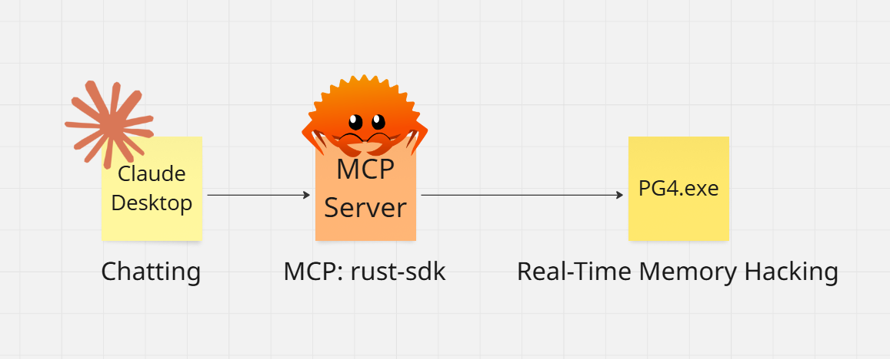

# Persona 4 Golden MCP Hack 🦀💰

## 📹 Demo Video
[](https://www.youtube.com/watch?v=ZTxv71cqurY)

## 📐 Architecture


MCP Rust-based memory hacking tool for **Persona 4 Golden**  
Set your in-game money in real-time using native Windows APIs.

> Powered by MCP: Rust-SDK. Built for precision. Inspired by Cheat Engine.

## 🎮 Features

- ✅ Reads process by name (`P4G.exe`)
- ✅ Finds base module address at runtime
- ✅ Resolves pointer path to in-game money
- ✅ Writes value directly to memory

## 🧰 Requirements

- Windows (tested on Windows 11)
- Persona 4 Golden (Steam version)
- Rust `stable`

## 🛠 Setup

1. Clone the repository and build the project

```bash
git clone https://github.com/your-name/persona-4-golden-mcp-hack.git
cd persona-4-golden-mcp-hack
cargo build --release --example persona_4_golden_mcp_hack
```

2. Set Claude desktop config

```json
{
  "mcpServers": {
    "persona4golden": {
      "command": "PATH-TO/persona-4-golden-mcp-hack/target/release/examples/persona_4_golden_mcp_hack.exe",
      "args": []
    }
  }
}
```

3. Chat with Claude and set your money

```text
set money in persona 4 golden to 19999
```
